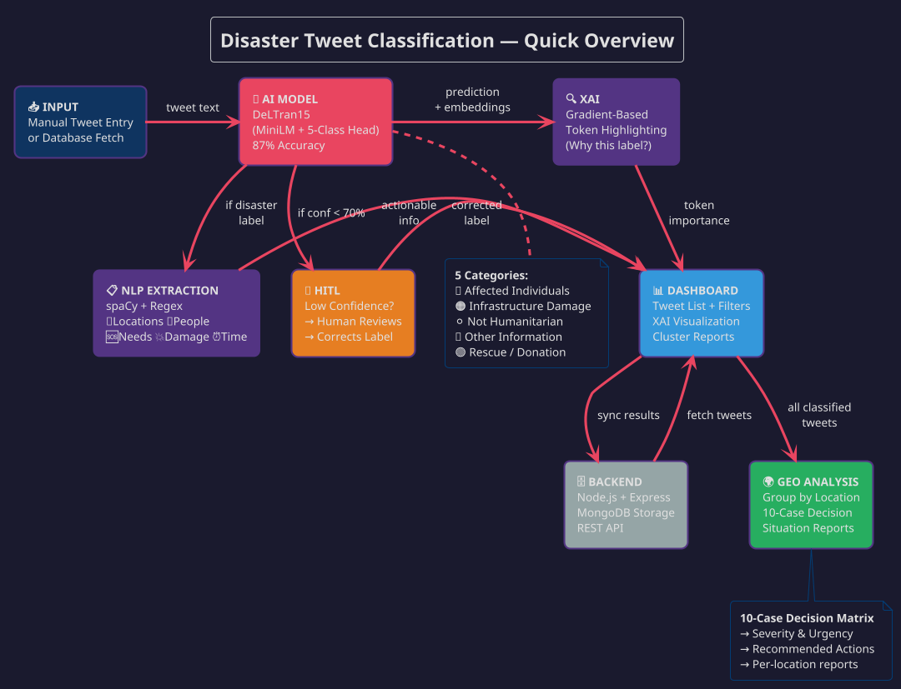
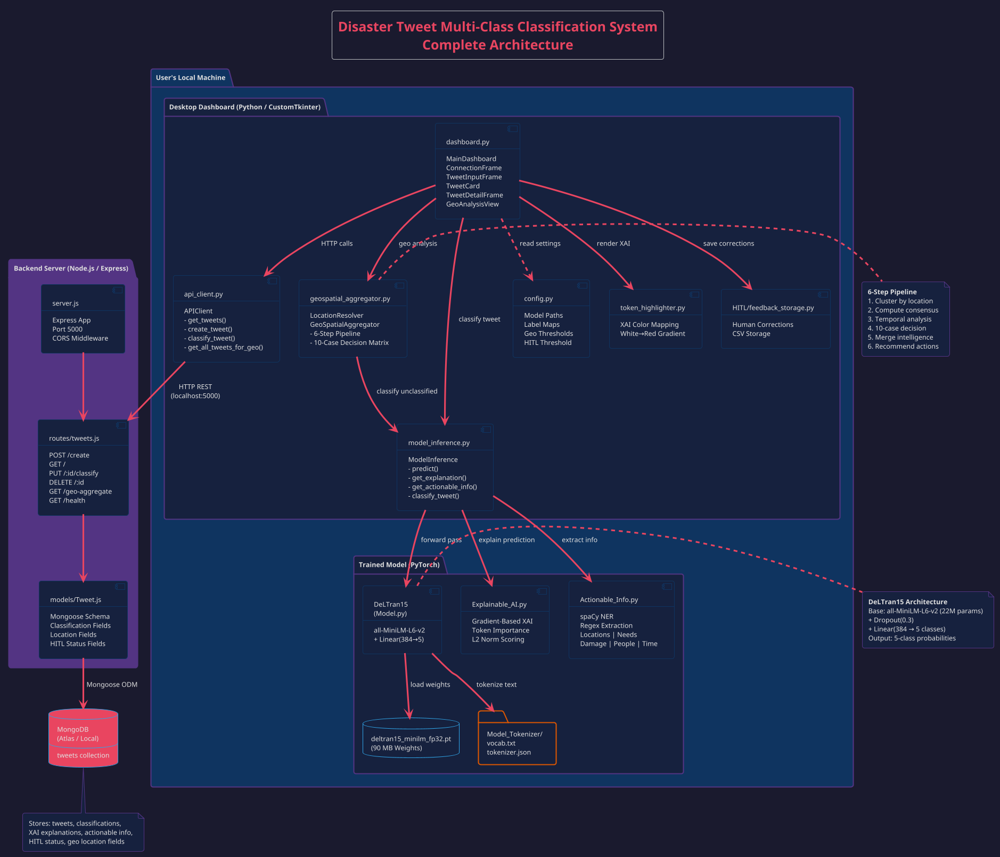
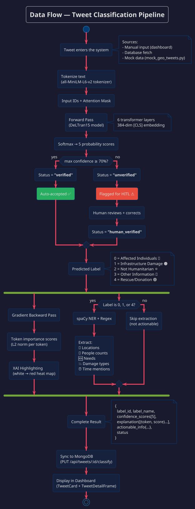
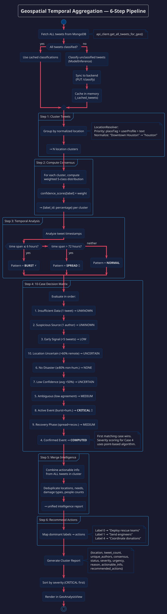
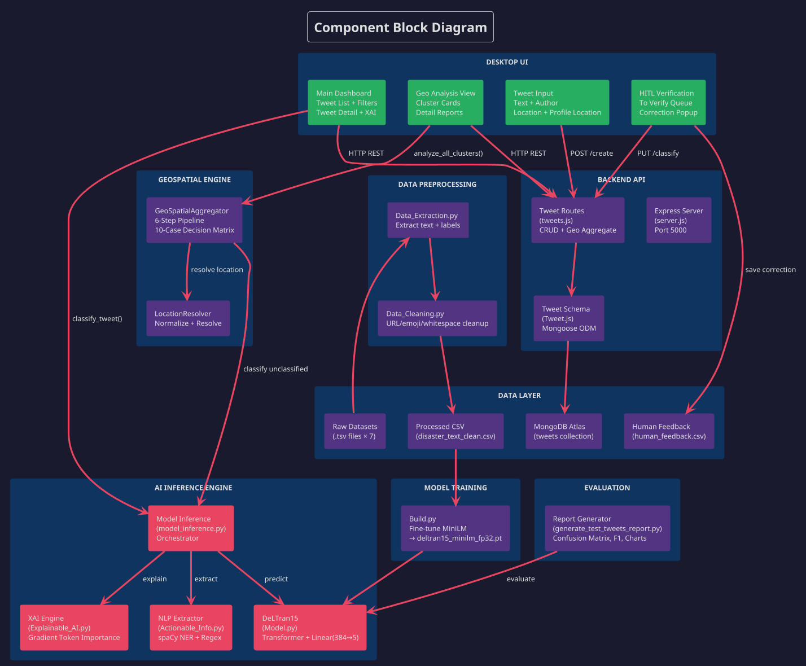
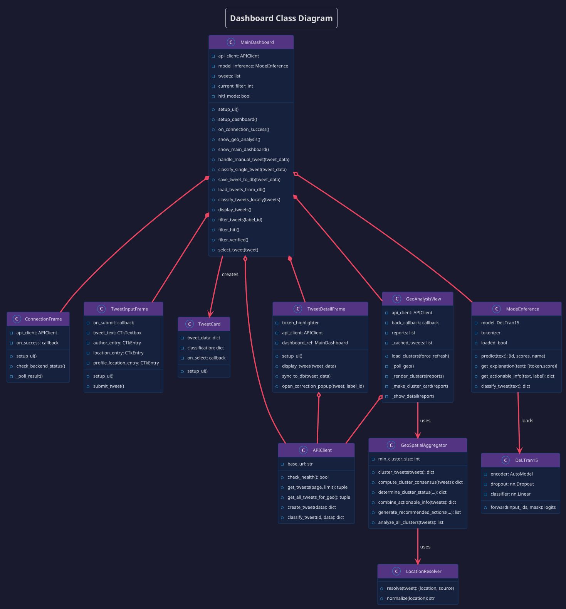
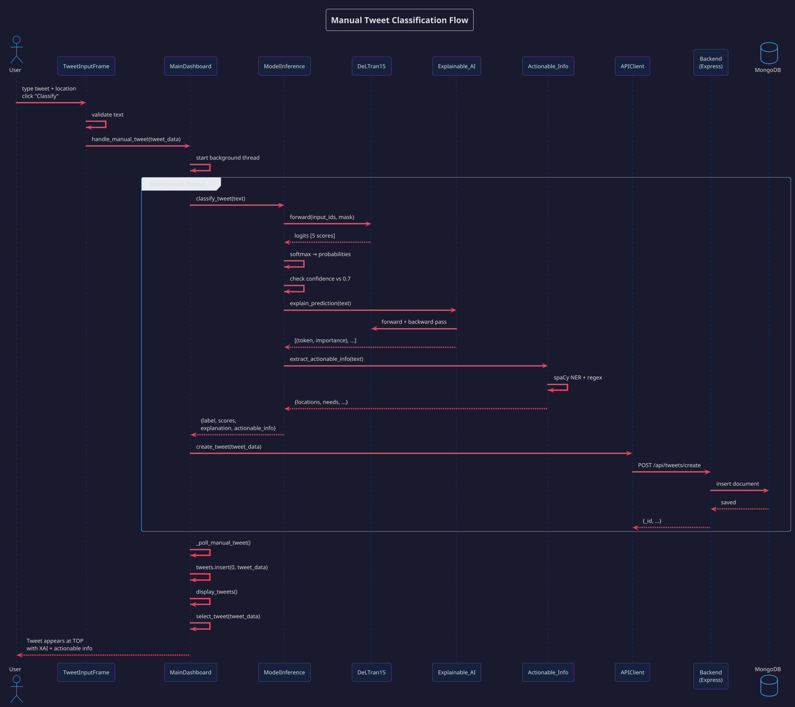

# Architecture Diagrams

This document contains PlantUML code for the project's architecture diagrams.
Copy the code into [PlantUML Online Editor](https://www.plantuml.com/plantuml/uml) to render.

---

## 0. Quick Overview — Simple Block Diagram

This diagram gives a **quick, at-a-glance** understanding of the entire project flow.

---

## 1. System Architecture Diagram

---

## 2. Data Flow Diagram

---

## 3. Geospatial Analysis Pipeline

---

## 4. Component Block Diagram

---

## 5. Class Diagram — Dashboard

---

## 6. Sequence Diagram — Manual Tweet Classification

---

## How to Render

1. **Online**: Go to [plantuml.com/plantuml/uml](https://www.plantuml.com/plantuml/uml), paste any code block above
2. **VS Code**: Install "PlantUML" extension, open this file, `Alt+D` to preview
3. **CLI**: `java -jar plantuml.jar ARCHITECTURE_DIAGRAMS.md` (renders all diagrams)
4. **IntelliJ**: Built-in PlantUML support with the PlantUML Integration plugin
