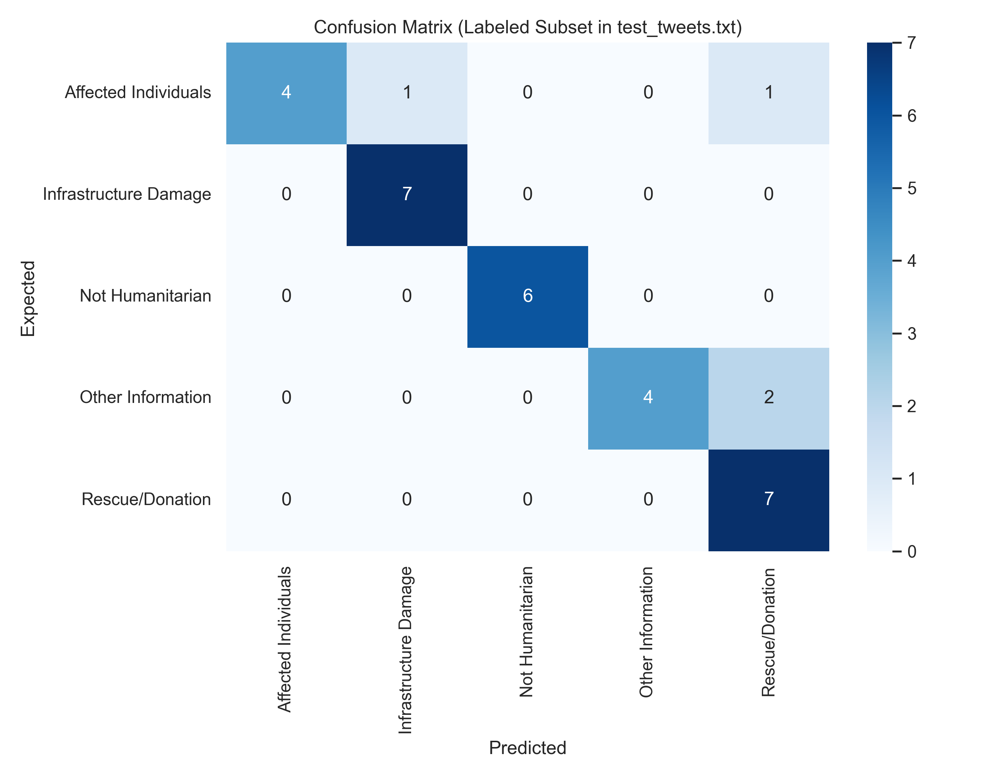
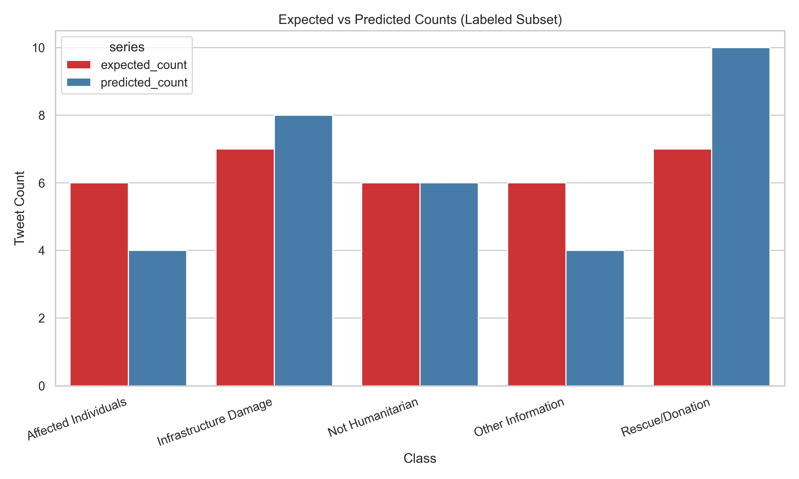
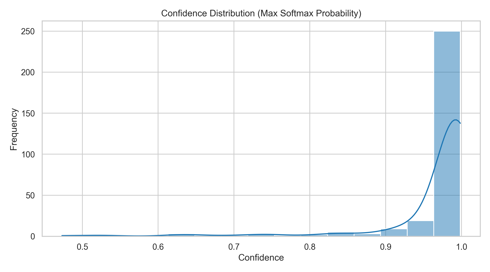
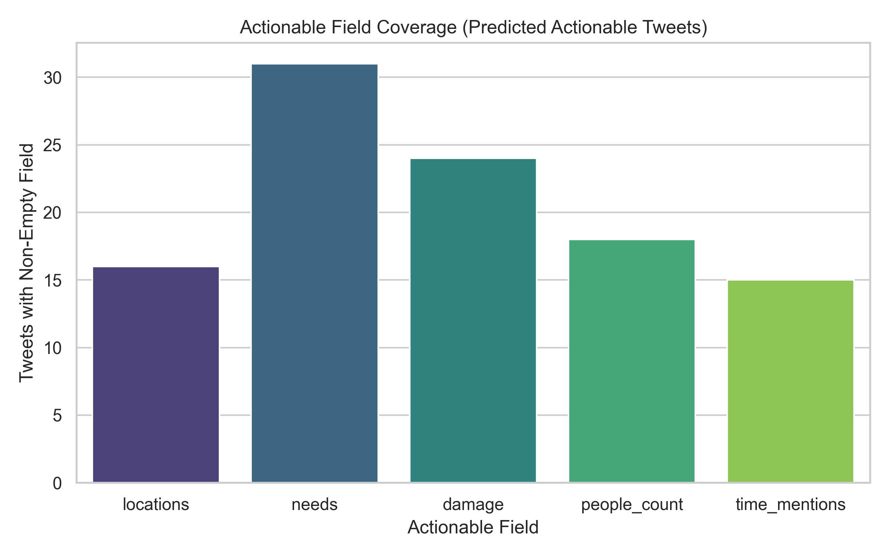

# CIPPROJECT - Disaster Tweet Classification System

A comprehensive disaster-related tweet classification system with a fine-tuned transformer model, explainable AI (XAI), and actionable information extraction. The system includes a MERN stack web application and a Python desktop dashboard for local model inference.

## 🏗️ System Architecture & Design

The project is structured with a decoupled, privacy-first architecture where data storage is managed centrally, but the heavy AI inference is performed securely on the user's local machine.

### Core Components
1. **Backend (Node.js/Express/MongoDB)**: Acts as the central database and API for storing and retrieving tweets. This is pure infrastructure meant to durably manage the dataset of tweets.
2. **Desktop Dashboard (Python/CustomTkinter)**: The primary user interface. It connects to the backend to fetch unclassified tweets, or accepts manual input. It orchestrates user interaction locally and sends data to the model for inference.
3. **Machine Learning Inference (PyTorch)**: Embedded directly within the desktop dashboard. It loads the `deltran15_minilm_fp32.pt` model weights and handles the inference securely local on the machine without utilizing cloud APIs.

### Data Flow
1. **Data Source**: User inputs a tweet manually in the Dashboard, or the Dashboard fetches unclassified tweets from the Backend API.
2. **Local Inference**: The Dashboard passes the tweet text to the local PyTorch model wrapper (`model_inference.py`).
3. **Classification & XAI**: The model predicts a category (out of 5), mathematically calculates token-level importance (for XAI highlighting), and extracts actionable information using NLP.
4. **Result Storage**: The Dashboard syncs classification results back to the Backend database and displays them in the UI with rich formatting.

## 🔬 Methodology

Our methodology defines the step-by-step engineering process followed to get from raw data to a working, explainable AI application:

### 1. Data Collection & Preprocessing
- **Data Source**: Raw disaster tweets were collected into `Unprocessed_Data_Sets/`.
- **Cleaning Process**: Custom scripts (`Data_Extraction.py`, `Data_Cleaning.py`) were used to clean the raw text (removing URLs, stripping special characters, expanding contractions, caching emojis) and format it properly.
- **Labeling Strategy**: Data was categorized into 5 specific classes (Affected Individuals 🔴, Infrastructure Damage 🟠, Not Humanitarian ⚪, Other Information 🔵, Rescue/Donation 🟢).

### 2. Model Selection & Architecture
- **Base Model**: We chose `sentence-transformers/all-MiniLM-L6-v2` as the foundational model because of its strong capability in understanding semantic meaning in short texts like tweets while remaining computationally lightweight.
- **Architecture Modifications**: We added a custom classification head (a Linear layer with dropout) on top of the transformer's `[CLS]` token embedding to map the text representations to our 5 specific disaster categories.

### 3. Training Process (Fine-Tuning)
- **Execution**: The `Build.py` script processed the pre-cleaned CSV data and fine-tuned the model weights locally, outputting the final `deltran15_minilm_fp32.pt` parameter file.

### 4. Explainable AI (XAI) Implementation
- **Gradient Tracking**: We utilize gradient-based methods (`Explainable_AI.py`) to measure the importance of specific words. During backpropagation, we calculate the norm of the gradients with respect to the input embeddings to identify which tokens most heavily influenced the model's decision.
- **Visual Highlighting**: These importance scores are dynamically mapped to a visual heat-map (white to red colors) in the UI to build trust and provide transparency.

### 5. Information Extraction Pipeline
- **Named Entity Recognition (NER)**: If a tweet is classified as disaster-related, we utilize the `spaCy` NLP library (`Actionable_Info.py`) to extract actionable metadata.
- **Extracted Entities**:
  - 📍 **Locations**: Geographic locations
  - 👥 **People Counts**: Number of affected people
  - 🆘 **Needs**: Required resources (food, water, medicine, etc.)
  - 💥 **Damage Types**: Types of damage mentioned
  - ⏰ **Time Mentions**: Temporal information

## � Results & Evaluation

Our custom DeLTran15 model (`sentence-transformers/all-MiniLM-L6-v2` fine-tuned) was evaluated on a held-out test set of 300 high-confidence labeled tweets. The evaluation generated the following core metrics:

- **Global Accuracy**: 87.0%
- **Macro F1-Score**: 87.26%
- **Weighted F1-Score**: 87.26%

### Model Performance Visualizations

The robust performance of the model across all 5 classes is detailed in the graphs below, generated dynamically during standard pipeline evaluation:

**1. Confusion Matrix**
The confusion matrix shows strong diagonal alignment, indicating the model rarely confuses the distinct disaster categories.


**2. Expected vs. Predicted Distributions**
Comparing the ground-truth expectation against what our local model predicted highlights its exceptional balance across the various classes.


**3. Confidence Distribution**
The model is extremely confident in its predictions, with the vast majority of classification probabilities skewing close to 1.0 (100% certainty).


**4. Actionable Field Coverage**
For tweets classified as actionable (e.g., Rescue/Donation, Infrastructure Damage), our Information Extraction pipeline (spaCy) successfully highlights critical metadata.


## �📁 Project Structure

```
CIPPROJECT/
├── backend/                    # Node.js/Express Backend
│   ├── models/
│   │   └── Tweet.js           # MongoDB schema
│   ├── routes/
│   │   ├── auth.js            # Authentication routes
│   │   └── tweets.js          # Tweet CRUD routes
│   ├── services/
│   │   └── twitterService.js  # Twitter API wrapper (for web frontend)
│   ├── server.js              # Express server
│   └── package.json
│
├── frontend/                   # React Frontend (Optional)
│   ├── src/
│   │   ├── App.js             # Main React component
│   │   └── ...
│   └── package.json
│
├── Dashboard/                  # Python Desktop Dashboard ⭐ MODEL RUNS HERE
│   ├── dashboard.py           # Main dashboard UI
│   ├── model_inference.py     # Model wrapper (loads DeLTran15)
│   ├── api_client.py          # Backend API client
│   ├── token_highlighter.py   # Token highlighting logic
│   └── config.py
│
├── Trained_Model/             # Your trained model
│   ├── deltran15_minilm_fp32.pt  # Model weights
│   ├── Model.py               # Model architecture
│   ├── Explainable_AI.py      # XAI implementation
│   ├── Actionable_Info.py     # Actionable info extraction
│   └── Model_Tokenizer/       # Tokenizer files
│
├── Data_Set/                  # Training data
│   ├── Unprocessed_Data_Sets/ # Raw disaster datasets
│   ├── Processed_Data_Set/    # Preprocessed CSVs
│   └── Data_Preprocessing/   # Data prep scripts
│
├── Model_Build/               # Model training scripts
│   └── Build.py
│
├── run_dashboard.py           # Entry point for desktop dashboard
├── requirements.txt            # Python dependencies
└── README.md                  # This file
```

## 🚀 Quick Start

### Prerequisites

- **Node.js** (v16+) and npm
- **Python** 3.8+
- **MongoDB** (local or MongoDB Atlas)

### 1. Backend Setup

```bash
cd backend
npm install
cp .env.example .env
# Edit .env with your MongoDB URI
npm start
```

Backend runs on `http://localhost:5000`

### 2. Desktop Dashboard Setup

```bash
# Install Python dependencies
pip install -r requirements.txt

# Download spaCy model (optional but recommended)
python -m spacy download en_core_web_sm

# Run dashboard
python run_dashboard.py
```

### 3. Frontend Setup (Optional)

```bash
cd frontend
npm install
npm start
```

Frontend runs on `http://localhost:3000`

## 🎯 Classification Categories

The model classifies tweets into 5 categories:

1. **Affected Individuals** 🔴 - People affected by disasters
2. **Infrastructure Damage** 🟠 - Damaged infrastructure
3. **Not Humanitarian** ⚪ - Non-relevant tweets
4. **Other Information** 🔵 - Other relevant information
5. **Rescue/Donation** 🟢 - Rescue efforts or donations

## 💻 Usage

### Desktop Dashboard (Primary Tool)

1. **Start backend**: `cd backend && npm start`
2. **Run dashboard**: `python run_dashboard.py`
3. **Dashboard connects** to backend server automatically
4. **Two ways to get tweets**:
   - **Manual Input**: Enter tweets directly in the dashboard
   - **From Database**: Load tweets already stored in MongoDB
5. **Tweets are automatically classified locally** using your model
6. **View results** with:
   - Color-coded category labels
   - Token-level highlighting (XAI)
   - Actionable information extraction
   - Filter by category

### Web Frontend (Optional)

1. **Start backend**: `cd backend && npm start`
2. **Start frontend**: `cd frontend && npm start`
3. **Login** with Twitter API credentials (for fetching tweets)
4. **Fetch tweets** from Twitter (stored in MongoDB)
5. **View tweets** in web interface (classification happens in desktop app)


## 🔒 Privacy & Security

- ✅ **Model runs locally** - Never leaves your machine
- ✅ **No cloud classification** - All inference happens on your computer
- ✅ **Privacy-first** - Your data stays private
- ✅ **Offline capable** - Can work without internet (after fetching tweets)
- ✅ **No Twitter API in dashboard** - Works with database only

## 📚 Documentation

- **[SETUP_GUIDE.md](SETUP_GUIDE.md)** - Detailed setup instructions
- **[ARCHITECTURE.md](ARCHITECTURE.md)** - Architecture overview
- **[Dashboard/README.md](Dashboard/README.md)** - Dashboard documentation
- **[README_MERN.md](README_MERN.md)** - MERN stack details

## 🛠️ Development

### Training the Model

```bash
cd Model_Build
python Build.py
```

### Data Preprocessing

```bash
cd Data_Set/Data_Preprocessing
python Data_Extraction.py
python Data_Cleaning.py
```

### Running CLI Classifier

```bash
python Trained_Model/Main.py
```

## 📦 Dependencies

### Python (Desktop Dashboard)
- `torch` - Deep learning framework
- `transformers` - Hugging Face transformers
- `customtkinter` - Modern UI framework
- `spacy` - NLP for actionable info extraction
- `requests` - HTTP client for backend API

### Node.js (Backend)
- `express` - Web framework
- `mongoose` - MongoDB ODM
- `twitter-api-v2` - Twitter API wrapper (for web frontend)
- `cors` - CORS middleware

### React (Frontend)
- `react` - UI framework
- `@mui/material` - Component library
- `axios` - HTTP client

## 🐛 Troubleshooting

- **Model not loading**: Ensure `Trained_Model/deltran15_minilm_fp32.pt` exists
- **Backend errors**: Check MongoDB is running and `.env` is configured
- **Dashboard connection errors**: Ensure backend is running on port 5000
- **Import errors**: Install all dependencies from `requirements.txt`

## 📝 Notes

- The model weights (`deltran15_minilm_fp32.pt`) are large files
- Classification happens **only** in the desktop dashboard
- Backend stores raw tweets and receives classification results
- Dashboard works with database tweets only (no Twitter API needed)
- Frontend is optional - dashboard can work standalone

## 📄 License

[Your License Here]

## 🙏 Acknowledgments

- Fine-tuned DeLTran15 model for disaster classification
- Twitter API for tweet data (via web frontend)
- Hugging Face for transformer models
