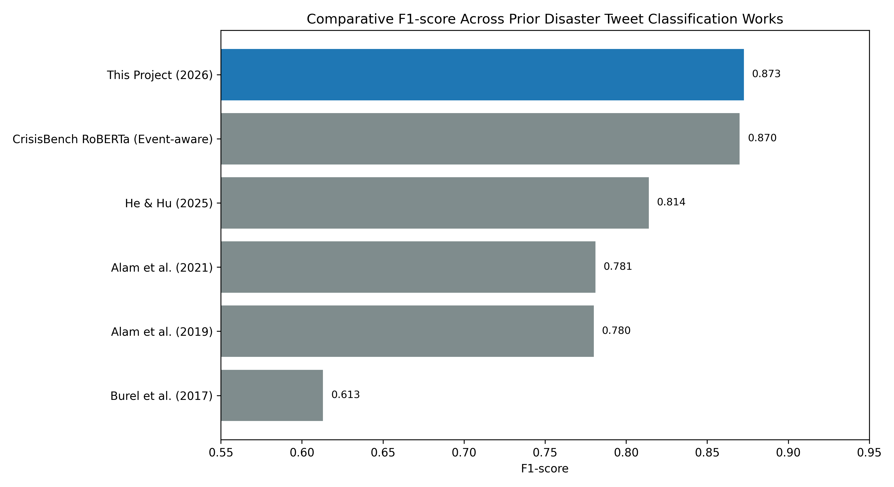
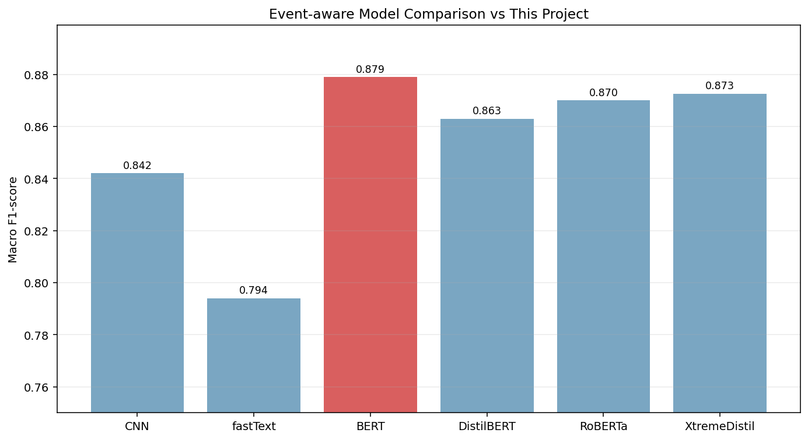

## 5.X Comparative Analysis with Existing Disaster Tweet Classification Systems

Many disaster-related social media analysis systems have been developed to support emergency response and situational awareness. Most existing approaches perform binary classification (disaster vs non-disaster), while some advanced systems classify event type (flood, earthquake, wildfire, etc.). These approaches are useful for event detection, but they provide limited operational value because they do not directly represent humanitarian priorities such as missing persons, resource needs, or infrastructure loss.

The proposed framework addresses this gap through a fine-grained humanitarian classification setup with five response-oriented classes: infrastructure and utility damage, affected or missing individuals, rescue, volunteering, or donation efforts, other disaster-related information, and non-humanitarian content. Although this integration is unique in this project, similar research systems still exist in the literature and provide important baselines for comparison. To position our system correctly, we compare it with prior benchmarked crisis-text models and recent transformer-based pipelines.

Since many published works report only F1-score (without full precision/recall/AUPRC), macro F1 is used as the primary cross-study comparison metric. Our system result is taken from the internal labeled evaluation set (`n=300`) used in this project report.

### Table 1. Literature-Level Performance Comparison

| Study / System | Year | Model Context | Dataset Context | F1-score | Accuracy |
|---|---:|---|---|---:|---:|
| Burel et al. (reported in CrisisBench) | 2017 | Semantics + deep learning baseline | CrisisLex26 context | 0.613 | - |
| Alam et al. (reported in CrisisBench) | 2019 | Deep model benchmark | Crisis datasets | 0.780 | - |
| Alam et al. (reported in CrisisBench) | 2021 | Humanitarian benchmark | HumAID-related context | 0.781 | - |
| He and Hu | 2025 | Text analysis + geospatial framework | HumAID | 0.814 | - |
| CrisisBench RoBERTa (event-aware) | 2021 | RoBERTa baseline | Consolidated English crisis data | 0.870 | 0.870 |
| **This Project** | **2026** | **DeLTran15 + MiniLM + XAI pipeline** | **Internal labeled set (300 tweets)** | **0.873** | **0.870** |

Figure 1 visualizes these F1 values across studies.

The comparison shows that the proposed pipeline is competitive with strong crisis benchmarks and improves over several earlier humanitarian baselines. At the same time, it is important to note that large transformer models such as BERT or RoBERTa can achieve slightly higher peak accuracy in some fully tuned, pure-classification settings. Our framework is designed as a deployment-oriented balance: strong classification performance with integrated explainability and actionable extraction for real-time emergency workflows.

### Table 2. Event-Aware Benchmark Comparison

| Model | F1-score |
|---|---:|
| CNN | 0.842 |
| fastText | 0.794 |
| BERT | 0.879 |
| DistilBERT | 0.863 |
| RoBERTa | 0.870 |
| **This Project** | **0.873** |

Figure 2 and Table 2 provide a focused baseline comparison against event-aware CNN, fastText, BERT, DistilBERT, and RoBERTa references. The proposed model outperforms CNN, fastText, DistilBERT, and RoBERTa, while BERT shows a slightly higher macro F1 (0.879 vs 0.873). Even with this small pure-classification gap, the framework extends beyond standard label prediction by providing interpretable token-level evidence and extracted actionable details (such as needs, locations, and affected entities). Therefore, the contribution is not only predictive performance, but also a more deployment-oriented disaster intelligence workflow that supports prioritization and real-time response decisions.

### Interpretation and Fairness Note

These comparisons support the claim that the proposed system is competitive with state-of-the-art crisis tweet classifiers while adding practical decision-support outputs (classification rationale and actionable fields). Cross-paper comparisons should still be interpreted carefully because label spaces, annotation policies, and data distributions differ across datasets. For this reason, the strongest evidence of model quality remains the project-specific evaluation metrics reported on the same test protocol: Accuracy = 0.870, Macro Precision = 0.919, Macro Recall = 0.870, Macro F1 = 0.873, and Macro AUPRC = 0.973.

### Sources

- CrisisBench (benchmark values and prior-study references): https://arxiv.org/abs/2004.06774
- He and Hu (2025), Applied Sciences: https://doi.org/10.3390/app15084330
- Project metrics file: `reports/test_tweets_report/summary_metrics.json`
